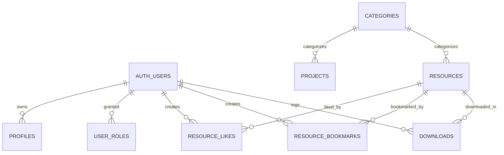
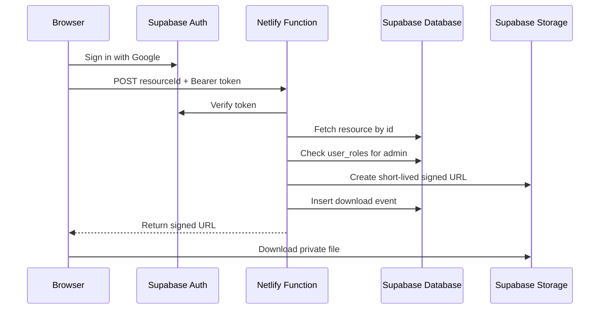

# Database

## Data model

### `profiles`

- `id uuid primary key references auth.users(id) on delete cascade`
- `display_name text`
- `avatar_url text`
- `created_at timestamptz not null default now()`
- `updated_at timestamptz not null default now()`

Purpose: minimal user profile metadata for authenticated identity and future extensibility.

### `user_roles`

- `user_id uuid primary key references auth.users(id) on delete cascade`
- `role text not null check (role = 'admin')`
- `created_at timestamptz not null default now()`

Purpose: database-backed admin authorization.

### `categories`

- `id uuid primary key default gen_random_uuid()`
- `slug text not null unique`
- `name text not null`
- `description text`
- `sort_order integer not null default 0`
- `created_at timestamptz not null default now()`
- `updated_at timestamptz not null default now()`

Constraints:

- `slug` is lowercase URL-safe and unique.
- `name` must not be blank.
- `lower(name)` is unique to prevent case-only duplicates.

### `projects`

- `id uuid primary key default gen_random_uuid()`
- `slug text not null unique`
- `title text not null`
- `summary text not null`
- `status text not null default 'draft'`
- `category_id uuid references public.categories(id) on delete set null`
- `featured boolean not null default false`
- `hero_image_url text`
- `body_md text`
- `live_url text`
- `repo_url text`
- `sort_order integer not null default 0`
- `created_at timestamptz not null default now()`
- `updated_at timestamptz not null default now()`

Purpose: public portfolio case studies.

### `resources`

- `id uuid primary key default gen_random_uuid()`
- `slug text not null unique`
- `title text not null`
- `teaser text not null`
- `description text`
- `category_id uuid not null references public.categories(id) on delete restrict`
- `file_path text not null unique`
- `file_type text not null`
- `mime_type text`
- `author text`
- `tags text[] not null default '{}'::text[]`
- `published boolean not null default false`
- `published_at timestamptz`
- `created_at timestamptz not null default now()`
- `updated_at timestamptz not null default now()`

Constraints:

- `slug` is lowercase URL-safe and unique.
- `title` and `teaser` must not be blank.
- `file_type` is limited to `pdf`, `docx`, `md`, or `zip`.
- `file_path` must follow the `resource_uuid/safe-name.ext` pattern.
- `mime_type`, when present, must be one of the allowed document MIME types.

### `resource_likes`

- `user_id uuid not null references auth.users(id) on delete cascade`
- `resource_id uuid not null references public.resources(id) on delete cascade`
- `created_at timestamptz not null default now()`
- composite primary key: `(user_id, resource_id)`

### `resource_bookmarks`

- `user_id uuid not null references auth.users(id) on delete cascade`
- `resource_id uuid not null references public.resources(id) on delete cascade`
- `created_at timestamptz not null default now()`
- composite primary key: `(user_id, resource_id)`

### `downloads`

- `id uuid primary key default gen_random_uuid()`
- `user_id uuid references auth.users(id) on delete set null`
- `resource_id uuid not null references public.resources(id) on delete cascade`
- `created_at timestamptz not null default now()`

Purpose: append-only download event log for trustworthy metrics. Browser clients do not insert into this table directly; the trusted download function records events with the service role after validation.

## Relationships

## Indexes

- `categories_name_lower_key` on `lower(name)`
- `projects_sort_order_idx` on `projects(sort_order)`
- `projects_category_id_idx` on `projects(category_id)`
- `resources_category_id_idx` on `resources(category_id)`
- `resources_published_created_at_idx` on `resources(published, created_at desc)`
- `resources_tags_gin_idx` on `resources using gin(tags)`
- `resources_file_path_key` on `resources(file_path)`
- `resource_likes_user_id_idx` on `resource_likes(user_id)`
- `resource_likes_resource_id_idx` on `resource_likes(resource_id)`
- `resource_bookmarks_user_id_idx` on `resource_bookmarks(user_id)`
- `resource_bookmarks_resource_id_idx` on `resource_bookmarks(resource_id)`
- `downloads_resource_id_idx` on `downloads(resource_id)`
- `downloads_user_id_idx` on `downloads(user_id)`
- `downloads_created_at_idx` on `downloads(created_at desc)`

## RLS summary

- `profiles`: owner or admin can read, insert, update, and delete their row.
- `user_roles`: admin only.
- `categories`: public read, admin write.
- `projects`: public can read published rows, admin can manage all rows.
- `resources`: public can read published rows, admin can manage all rows.
- `resource_likes`: users can read, insert, and delete only their own rows; admin can read all.
- `resource_bookmarks`: authenticated users can read and delete only their own rows. Direct browser inserts are denied; `save_resource(uuid)` derives ownership from `auth.uid()` and accepts only published resources.
- `downloads`: authenticated users can insert rows for their own published-resource downloads; owners and admin can read; admin can delete.
- `storage.objects`: admin manages the private resource bucket; file delivery uses signed URLs from a trusted backend path.

## Deletion behavior

- Deleting an auth user cascades to `profiles`, `user_roles`, `resource_likes`, and `resource_bookmarks`.
- Deleting an auth user nulls `downloads.user_id` so analytics can remain without personal identity.
- Deleting a resource cascades to likes, bookmarks, and download events.
- Deleting a category is blocked when referenced by resources.
- Deleting a project nulls its category reference.
- Storage objects are deleted separately through the storage API or trusted backend flow.

## Admin model

`user_roles` is the source of truth for elevated access. The initial admin is granted manually by inserting a row for the user’s `auth.users.id` through a privileged SQL path or dashboard session. Admin status is never inferred from email alone.

## Profile creation flow

`public.handle_new_user()` is triggered after inserts into `auth.users`. It creates the matching `profiles` row server-side and copies only safe V1 metadata:

- `display_name` from `display_name`, `full_name`, or `name`
- `avatar_url` from `avatar_url` or `picture`

## Storage model

The `resources` bucket is private. Uploads are restricted to admin users and object paths are normalized to `resource_uuid/safe-name.ext`. Files are limited to the document types needed for V1 and capped to the free-tier size budget.

## Download model

Downloads are event-based rather than counter-based. Each successful trusted download inserts one row into `downloads`, which means repeated downloads are allowed and total counts can be derived with aggregation without exposing a writable counter column.

## Secure download flow

## Migration note

`0001_initial.sql` establishes the base schema. `0002_security_hardening.sql` tightens authorization, storage, and integrity rules without introducing frontend assumptions.
`0003_profile_trigger_and_download_boundary.sql` adds server-side profile creation and closes the browser write path for download logging.
`0004_resource_category_taxonomy.sql` reconciles categories to Documentation, Engineering Notes, Web, Mobile, System Design, and AI Prompts. It merges only the direct legacy aliases Web Development → Web and Mobile Development → Mobile while preserving `resources.category_id` and `projects.category_id`. If any broader or unknown legacy category is referenced, the transaction aborts and reports its slug and relationship counts instead of guessing a destination. Unreferenced noncanonical rows are removed, leaving exactly six categories.
`0005_saved_resources_boundary.sql` reuses the normalized bookmark table for private Saved utility. It removes direct inserts, makes read/delete policies strictly owner-only, and grants authenticated execution of idempotent `save_resource(uuid)` and `unsave_resource(uuid)` functions. The functions derive the owner from `auth.uid()`; no browser-supplied user ID is accepted.

`0006_admin_cms_analytics.sql` adds the Phase 08 admin boundary. It keeps `user_roles` and `is_admin()` as the sole authority, makes direct download-event reads owner-only, adds bounded resource metadata constraints, and exposes only admin-checked aggregate RPCs for overview, resource, category, user-summary, trend, and recent-activity views. Each RPC is `SECURITY DEFINER` with an empty search path, rejects non-admin callers, and is executable only by authenticated users. Bookmark ownership policies are unchanged.

`0007_resource_archiving.sql` adds the explicit `archived_at` state and prevents archived rows from also being published. Public resource RLS, new saves, resource likes, category live counts, and recent publication activity exclude archives. Historical bookmark/download rows and aggregate metrics remain intact. The Admin can restore an archive to draft; there is no ordinary permanent-delete workflow.

Analytics events currently have indefinite retention. User deletion preserves anonymous download events by nulling `downloads.user_id`; bookmark rows are removed with the user. A shorter retention or erasure policy requires an explicit product/privacy decision before production launch.
