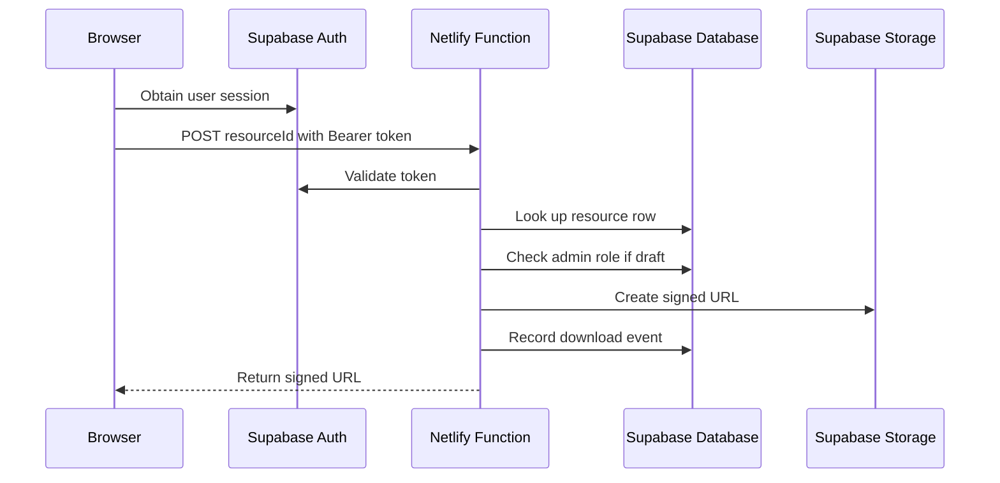

# Security

## Trust boundaries

- Browser code may read public data and send authenticated requests, but it must never hold privileged secrets.
- Supabase enforces row-level access, role checks, and private storage access.
- Trusted server functions handle contact submission and future signed-download generation.

## Browser vs database responsibilities

- Browser: rendering, form collection, and requesting allowed operations.
- Database: authorization, row ownership, admin checks, and data integrity.
- Server functions: secret-bearing actions, validation, and temporary signed access to private files.

## Authentication

Google OAuth is the intended V1 sign-in path. No email-password flow exists in this phase.

The browser should send the Supabase access token to the trusted download function. The function validates the token against Supabase Auth before doing any privileged work.

## Admin authorization

Admin access is controlled through `public.user_roles`, not a frontend email comparison. The `public.is_admin()` helper is a narrow `SECURITY DEFINER` function with a pinned `search_path` and a single job: check whether the current user has the `admin` role.

## Storage protection

- The `resources` bucket is private.
- Admin users upload, replace, and delete files.
- File names are normalized to safe object paths.
- Allowed file types are restricted to PDF, DOCX, Markdown, and ZIP.
- Public visitors never receive unrestricted object URLs.
- Download delivery should happen through a trusted signed-URL path after publication checks.

## Secure download boundary

The browser never receives service-role credentials or arbitrary file-path control. The trusted function accepts only a validated `resourceId`, fetches the canonical file path from the database, confirms publication and ownership rules, creates a short-lived signed URL, and logs the event with server credentials.

## Secure download flow

## Secrets

- Browser-safe values: `SITE_URL`, `SUPABASE_URL`, `SUPABASE_ANON_KEY`, and OAuth client IDs.
- Server-only secrets: service-role key, mail API key, and any future signing secret.
- Secrets must never be committed to git or embedded in browser JavaScript.

## Contact function

The contact endpoint is POST-only, rejects oversized payloads, validates inputs, and uses a honeypot field to reduce spam noise. It should keep responses generic and log only what is needed for operations.

## Security headers

The site uses a strict foundation:

- `Content-Security-Policy`
- `X-Content-Type-Options`
- `Referrer-Policy`
- `Permissions-Policy`

The CSP allows only same-origin assets plus the Supabase and Google OAuth origins needed for the future auth flow. No `unsafe-eval` is permitted. Inline scripts are avoided so the policy can stay strict.

## XSS strategy

- Avoid `innerHTML` for user-generated content.
- Render Markdown and rich content on the server or through a trusted sanitizer.
- Keep the DOM simple and prefer text nodes over raw HTML injection.
- Treat resource metadata as untrusted until sanitized.

## Saved-resource boundary

- `resource_bookmarks` has an owner-scoped composite primary key, preventing duplicate relationships.
- Authenticated reads and deletes require `user_id = auth.uid()`; there is no cross-user or admin-readable Saved policy.
- Browser inserts are denied. `save_resource(uuid)` and `unsave_resource(uuid)` derive the owner from `auth.uid()` inside PostgreSQL and accept no user ID argument.
- Saving is limited to published resources and uses `ON CONFLICT DO NOTHING` for idempotency.
- Saved metadata is queried separately with `published = true`; an unpublished or deleted record is represented only as unavailable.

## Admin and analytics boundary

- Admin status is resolved from `user_roles` through `is_admin(auth.uid())`; neither route access nor a browser-visible email grants authority.
- The admin shell fetches or renders protected values only after the database confirms authorization. Direct navigation therefore cannot bypass RLS.
- Resource/category mutations and private storage uploads remain covered by admin RLS. Upload names are normalized and file type/size are validated before storage.
- Aggregate RPCs re-check admin status server-side, set an explicit empty search path, and return only the fields needed by the dashboard.
- Raw bookmark rows remain owner-only. Raw download rows are owner-only after Phase 08; administrators consume derived metrics instead of browsing event rows.
- No service-role key, storage path, signed URL, or unrestricted user identity data is exposed by the Admin UI.
- Permanent resource deletion is withheld until cascade, file cleanup, retention, and audit expectations are decided. Admins may safely unpublish resources in the meantime.

## Production secret separation

- Browser artifact: `SUPABASE_URL` and `SUPABASE_PUBLISHABLE_KEY` only. These identify the public client and remain constrained by RLS.
- Netlify Functions only: `SUPABASE_SERVICE_ROLE_KEY`, `RESEND_API_KEY`, and `CONTACT_FROM_EMAIL`. `CONTACT_TO_EMAIL` is operational configuration, not a credential.
- Google client secret exists only in the Supabase Google-provider configuration.
- `scripts/scan-public-secrets.mjs` scans the generated `dist/` artifact for JWT-shaped keys, Resend keys, Google client secrets, private keys, and any configured server-secret values.
- Netlify publishes only `dist/`, preventing Function source, SQL, tests, and operational documentation from becoming static assets.

## Archive security

An archived resource has `archived_at` set and `published = false`. RLS excludes it from anonymous and normal authenticated reads; the save RPC rejects it; the trusted download function rejects it before resolving roles or generating a signed URL. Its private Storage object and historical events remain retained.

## Dependency policy

- Prefer small, well-understood dependencies.
- Avoid adding CDN scripts unless they are explicitly approved.
- Keep lockfiles committed.
- Review new packages for supply-chain risk before shipping them to production.

## Threat model

| Threat | Asset at risk | Likely attack path | Mitigation |
| --- | --- | --- | --- |
| Privilege escalation | Admin operations, storage access | Frontend email check or writable role field | `user_roles`, `is_admin()`, RLS, no writable admin flags |
| IDOR / broken access control | Saved items, downloads, profiles | User guesses another row’s UUID | Owner-scoped policies, foreign keys, admin-only overrides |
| XSS | Session tokens, private data | Unsanitized metadata or HTML injection | CSP, text rendering, sanitization, no inline JS |
| Malicious resource metadata | Public pages, search | Harmful titles, links, or Markdown | Validation, sanitization, length limits |
| Unsafe file uploads | Users, storage integrity | Arbitrary file types or paths | Private bucket, allowlist, safe object names, size limits |
| Stolen browser tokens | Authenticated session | Token theft via XSS or unsafe storage | CSP, no local secret storage, limited client privileges |
| Leaked environment secrets | Entire backend | Committing service keys or API keys | `.gitignore`, server-only env vars, code review |
| Admin route discovery | Admin surface | Guessing paths and trying direct access | RLS, admin-only data access, no security by obscurity assumptions |
| Download counter manipulation | Metrics integrity | Direct `UPDATE` against counters | Event log instead of writable counters |
| Bookmark/like impersonation | Saved state | Client submits another user’s ID | `auth.uid() = user_id`, composite PKs, RLS |
| OAuth redirect misconfiguration | Auth flow | Redirect to attacker-controlled origin | Exact redirect allowlist, known provider settings |
| Spam/contact abuse | Inbox, logs | Flooding form endpoint | POST-only, body limits, honeypot, rate limiting later |
| Supply-chain/CDN risk | Browser trust boundary | Malicious third-party script | Avoid external scripts by default |
| Future community abuse surface | Moderation workload, user safety | Public input features added later without guardrails | Keep V1 narrow, design moderation hooks before expansion |

## Function boundaries

- `public.is_admin()` is narrow and only checks the `user_roles` table.
- `public.handle_new_user()` only inserts a minimal profile row.
- The contact function rejects oversized and malformed bodies and never reflects raw HTML.
- The download function uses server credentials only and does not expose file paths or service keys to the browser.
